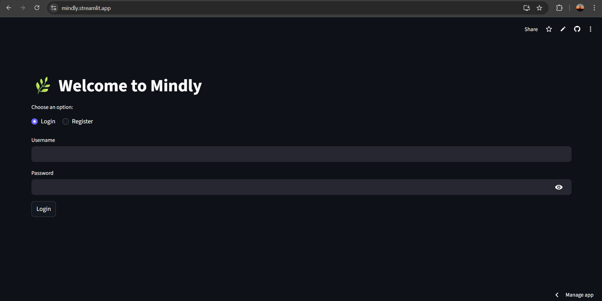
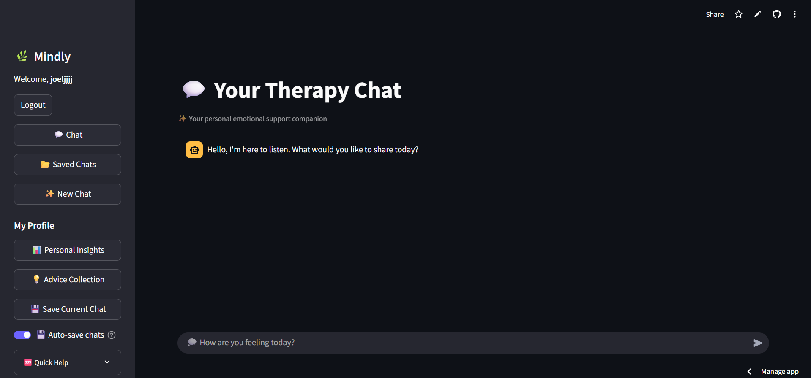
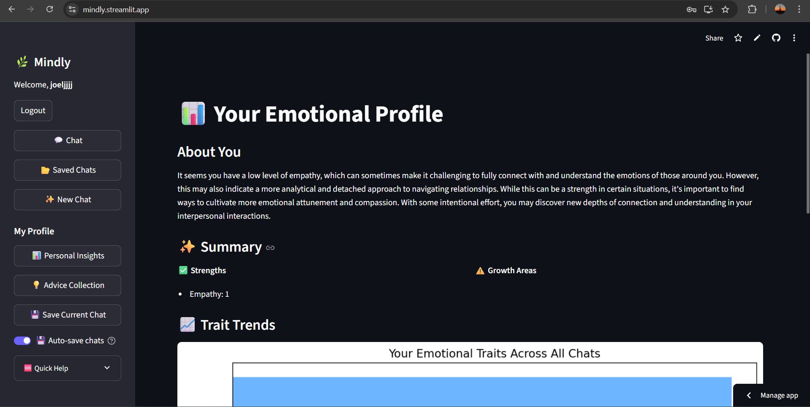
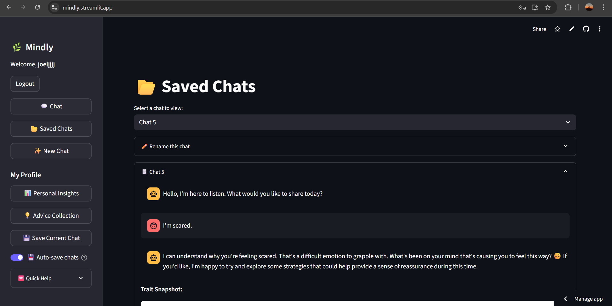
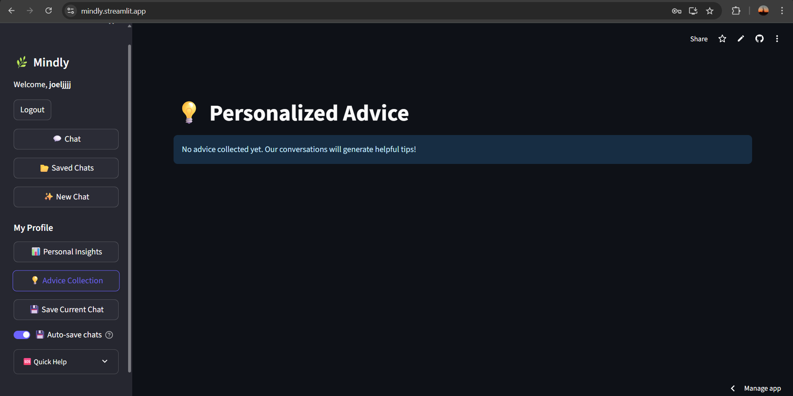

# 🌿 Mindly – Your Personal Therapy Companion

**Mindly** is a full-featured, AI-powered emotional support app built with [Streamlit](https://streamlit.io). Designed as a compassionate space for reflection, healing, and growth, Mindly combines the empathy of a therapist with the intelligence of real-time trait analysis, session memory, and personalized advice collection.

> _"I built this for anyone who just wants to talk, reflect, and feel heard—even when no one’s around."_

The link to Mindly => https://mindly.streamlit.app/

## 🧠 Why Mindly?

Many of us face moments when we just need someone to *listen*—without judgment, without rush. Mindly is a digital space that simulates this experience. It doesn't replace therapy, but it bridges that emotional gap with:

- 💬 **Empathetic Conversations**
- 🧭 **Personalized Trait Insights**
- 💡 **Actionable Advice from Chat History**
- 📈 **Emotional Trend Analysis**
- 🔐 **Secure Authentication & Chat Storage**
- 🌍 **Crisis Helpline Detection by Country**

## 🔐 Features

**🧠 AI-Powered Therapy Chat** -  Built on Claude 3 (via OpenRouter), trained to listen, respond gently, and ask meaningful questions.
**📊 Dynamic Emotional Profile** - Automatically tracks and visualizes emotional traits like Empathy, Anxiety, Confidence, and more.
**💡 Advice Extraction System** - Picks out therapist-style suggestions from conversations and refines them into actionable sentences.
**💾 Save + AutoSave Chats** - Seamlessly save sessions and auto-save after each exchange for future reference.
**📂 Saved Chat Viewer** - Navigate previous sessions, rename, and visualize emotional trends. **🆘 Country-Specific Crisis Resources** - Auto-detects or allows manual selection of crisis helplines based on location.
**🔐 Auth System (Login/Register)** - Secure YAML-based login system with hashed password storage and optional email.

## 📷 Screenshots
Login Page:


Chat Page:


Profile


Saved Chats:


Advice Collection Page:



## 🛠️ Built With

- **Python 3.10+**
- [**Streamlit**](https://streamlit.io/)
- **Anthropic Claude 3 API via OpenRouter**
- `passlib` for password hashing
- `pycountry` + `ipapi.co` for geo-location & crisis resources
- `matplotlib` for trait visualization
- `yaml`, `json`, `re`, `requests` for backend logic

---

## ⚙️ How to Run

1. **Clone the repository**
```bash
   git clone https://github.com/yourusername/mindly.git
   cd mindly
```

2. **Install dependencies**
```bash
pip install -r requirements.txt
```

3. **Set your API Key**
Add this to .streamlit/secrets.toml:

```toml
[OPENROUTER_API_KEY]
key = "your-openrouter-key-here"
```

4. **Run the app**

```bash
streamlit run mindly.py
```

## 🧠 Emotional Traits Tracked
Empathy

Self-Awareness

Confidence

Optimism

Anxiety

Mood Swings

These are inferred automatically through natural language analysis and updated live as you chat.

## 📌 Vision
This project is more than just code. It's an experiment in blending technology with emotional wellness—building AI that doesn't just compute, but connects.

Whether you're a developer, therapist, or just someone who cares about mental health, I hope Mindly resonates with you.

## 🧑‍💻 Acknowledgements
Anthropic Claude API via OpenRouter

Streamlit for making rapid app development beautiful and easy

Everyone who's exploring emotional wellness through tech ❤️

## Disclaimer: Mindly is not a substitute for professional mental health treatment. For urgent support, please use the crisis helplines listed in the app.